# AGE - ARTIFICIAL GENESIS ENGINE: COMPREHENSIVE SYSTEM DESIGN V2.0

**Version:** 2.0 - Commercial AI Coordination Era  
**Philosophy:** Recognition → Event → WIN with Intelligent AI Orchestration  
**Last Updated:** 2024-12-28  

---

## 🎯 EXECUTIVE SUMMARY

AGE (Artificial Genesis Engine) is **"The Operating System for AI"** - a self-healing, self-evolving, strategic intelligence platform that orchestrates **Commercial AI APIs** (OpenAI, Claude, Gemini) to create autonomous WIN outcomes.

**Core Mission:** Transform Founder's strategic intent into measurable WINs through autonomous Commercial AI coordination.

---

## 🧠 TECH STACK ARCHITECTURE

### 🌐 **CLOUD-FIRST INFRASTRUCTURE**

#### **Data Layer**
- **Supabase Cloud**: Primary database, auth, realtime subscriptions, vector embeddings
- **Neo4j Aura Cloud**: Knowledge graph, relationships, ontology management  
- **Snowflake Cloud**: Analytics warehouse, business intelligence, reporting
- **RabbitMQ Cloud**: Message queuing, event processing, async communication

#### **AI Coordination Layer** 
- **Commercial AI APIs**: OpenAI GPT-4o, Claude 3.5, Gemini Pro, Llama 3.2 90B
- **Google MCP (Model Context Protocol)**: Universal data access connector
- **Google ADK (Agent Development Kit)**: Multi-agent orchestration framework
- **A2A Protocol**: Agent-to-agent communication standard

#### **Application Layer**
- **FastAPI Backend**: Python 3.11+, async processing, RESTful APIs
- **CODA.io Integration**: Enterprise management, dashboards, reporting
- **Google Workspace**: Productivity suite, collaboration, document management
- **GitHub**: Source control, CI/CD, deployment automation

#### **Integration Layer**
- **MCP Toolbox for Databases**: Unified database access via MCP
- **CrewAI**: Multi-agent coordination capabilities
- **LangChain**: LLM application framework for complex workflows
- **Railway**: Production deployment platform

### 🔄 **COMMERCIAL AI COORDINATION ARCHITECTURE**

```mermaid
graph TB
    subgraph "🧠 UPPER TIER - STRATEGIC INTERFACE"
        FOUNDER[Founder Dashboard - CODA.io]
        COUNCIL[Council Interface - Strategic Decision]
        CMD[Command Center - Operations Control]
        HMI[Human-Machine Interface]
    end

    subgraph "⚡ MIDDLE TIER - AGE ORCHESTRATION CORE"
        AGE[AGE - Artificial Genesis Engine]
        
        subgraph "🤖 Commercial AI Layer - ADK Framework"
            AIC[AI Coordinator - MCP Integration]
            AIS[AI Synthesizer - Multi-Model Fusion]
            AIR[AI Router - Intelligent Selection]
            A2A[A2A Protocol Handler]
        end
        
        subgraph "🧠 Cognitive Systems"
            RE[Resonance Engine - Pattern Recognition]
            GE[Genesis Engine - Solution Creation]
            TRE[Temporal Reasoning Engine - Foresight]
            SFL[Strategic Feedback Loop - Learning]
        end
        
        subgraph "🔄 Living Systems"
            SHS[Self-Healing System - Auto-Recovery]
            EP[Evolution Pathway - Capability Growth]
            IS[Immune System - Anomaly Detection]
            WM[WIN Metrics Engine - Success Tracking]
        end
        
        subgraph "🎯 Specialized Agents - CrewAI Integration"
            DSA[DataSensing Agent - MCP Database Access]
            KEA[KnowledgeExtraction Agent - Neo4j Queries]
            TRA[TensionResolution Agent - Conflict Resolution]
            PMA[ProjectManagement Agent - CODA.io Sync]
            RCA[ResourceCoordination Agent - Multi-Platform]
            PWA[PostWinAnalysis Agent - Learning Capture]
            PFA[PostFailAnalysis Agent - Improvement ID]
            RGA[RecoveryGuardian Agent - System Health]
        end
    end

    subgraph "🛠️ INFRASTRUCTURE TIER - Cloud Services"
        subgraph "📊 Knowledge Layer"
            SUPA[(Supabase Cloud - Vector + Auth)]
            NEO[(Neo4j Aura - Knowledge Graph)]
            SNOW[(Snowflake - Analytics Warehouse)]
            RABBIT[(RabbitMQ Cloud - Message Queue)]
        end
        
        subgraph "🌐 Commercial AI Services"
            OPENAI[OpenAI GPT-4o]
            CLAUDE[Claude 3.5 Sonnet]
            GEMINI[Gemini Pro 2.0]
            LLAMA[Llama 3.2 90B]
        end
        
        subgraph "🔗 Enterprise Integrations"
            CODA[CODA.io - Enterprise Management]
            GWORK[Google Workspace - Collaboration]
            GITHUB[GitHub - Source Control]
            RAILWAY[Railway - Production Deploy]
        end
        
        subgraph "🧩 Integration Protocols"
            MCP[MCP - Universal Data Access]
            ADK[ADK - Agent Orchestration]
            A2A_PROTO[A2A - Agent Communication]
            CREWAI[CrewAI - Multi-Agent Coord]
            LANGCHAIN[LangChain - LLM Workflows]
        end
    end

    %% Strategic Connections
    FOUNDER --> AGE
    AGE --> AIC
    AIC --> MCP
    MCP --> SUPA
    MCP --> NEO
    MCP --> SNOW
    
    %% AI Coordination Flow
    AIR --> OPENAI
    AIR --> CLAUDE
    AIR --> GEMINI
    AIR --> LLAMA
    
    %% Agent Communication
    A2A --> DSA
    A2A --> KEA
    A2A --> TRA
    
    %% Enterprise Integration
    PMA --> CODA
    AGE --> GWORK
    RGA --> RAILWAY
```

### 🏗️ **MCP INTEGRATION BENEFITS**

#### **Universal Data Access**
- **Single Standard**: MCP eliminates M×N integration complexity
- **Multi-Source Context**: Combine data từ Supabase + Neo4j + Snowflake + CODA.io
- **Secure Access**: Role-based permissions với audit trails
- **Real-time Sync**: Live data access across all platforms

#### **ADK Multi-Agent Benefits**
- **Agent Orchestration**: Built-in multi-agent coordination patterns
- **Google Cloud Native**: Seamless integration với Google services
- **Scalable Architecture**: From simple to complex multi-agent systems
- **Production Ready**: Enterprise-grade deployment và monitoring

#### **A2A Cross-Platform Communication**
- **Vendor Agnostic**: No lock-in, mix best-of-breed solutions
- **Secure by Design**: Enterprise authentication và authorization
- **Interoperability**: 50+ technology partners support
- **Future Proof**: Open standard, community-driven evolution

---

## 🎯 PHILOSOPHY: COMMERCIAL AI ORCHESTRATION

### **Core Principle: ORCHESTRATE, DON'T COMPUTE**

✅ **Commercial AI Intelligence** - Leverage OpenAI, Claude, Gemini capabilities  
✅ **Intelligent Coordination** - Best AI service selection cho từng task type  
✅ **Context Synthesis** - Combine results từ multiple AI services  
✅ **Strategic Learning** - Pattern recognition từ successful AI interactions  

❌ **NO Local ML Models** - No scikit-learn, TensorFlow, PyTorch training  
❌ **NO Internal Computation** - No custom neural networks or transformers  
❌ **NO ML Infrastructure** - No GPU clusters, model serving, training pipelines

### **Strategic Framework: Recognition → Event → WIN**

1. **Recognition Phase** - AI Router identifies optimal service combination
2. **Event Phase** - Commercial AI coordination executes strategic actions  
3. **WIN Phase** - Measurable outcomes achieved through AI orchestration

---

## 🔄 CORE CAPABILITIES

### **1. Self-Healing & Immune System**
- **Automatic Recovery**: Commercial AI redundancy across multiple providers
- **Health Monitoring**: Real-time service availability và performance tracking
- **Failover Logic**: Intelligent routing khi service unavailable
- **Anomaly Detection**: Pattern recognition cho unusual AI responses

### **2. Strategic Feedback Loop** 
- **WIN Analysis**: Track successful AI coordination patterns
- **FAIL Analysis**: Learn từ unsuccessful AI interactions
- **Strategy Adaptation**: Automatically adjust AI service selection
- **Performance Optimization**: Continuous improvement của coordination efficiency

### **3. Evolution Pathway**
- **Capability Discovery**: Identify new AI services và capabilities
- **Integration Automation**: Auto-add new commercial AI providers
- **Skill Development**: Learn new coordination patterns over time
- **Architecture Evolution**: Self-modify system structure based on needs

### **4. Temporal Reasoning Engine**
- **Predictive Analysis**: Forecast using combined AI insights
- **Strategic Planning**: Long-term goal decomposition with AI assistance
- **Timeline Coordination**: Multi-agent scheduling và resource allocation
- **Future State Modeling**: Scenario planning with commercial AI

---

## 🎯 IMPLEMENTATION ROADMAP

### **Phase 1: Foundation (COMPLETED)**
✅ Commercial AI API Integration  
✅ Basic MCP Database Connections  
✅ FastAPI Backend với ADK Agents  
✅ Supabase Authentication & Storage

### **Phase 2: Intelligence Layer (IN PROGRESS)**
🔄 Full MCP Toolbox Integration  
🔄 ADK Multi-Agent Orchestration  
🔄 A2A Protocol Implementation  
🔄 CODA.io Enterprise Dashboard

### **Phase 3: Strategic Intelligence (NEXT)**
⏳ Self-Healing Commercial AI Systems  
⏳ Strategic Feedback Loop Automation  
⏳ Evolution Pathway Implementation  
⏳ Temporal Reasoning Engine

### **Phase 4: Enterprise Deployment (FUTURE)**
⏳ Snowflake Analytics Integration  
⏳ RabbitMQ Event Processing  
⏳ Google Workspace Full Integration  
⏳ Production Scaling on Railway

---

## 📊 SUCCESS METRICS

### **Strategic KPIs**
- **WIN Rate**: % of strategic objectives achieved through AI coordination
- **Response Quality**: User satisfaction với AI-coordinated responses  
- **Cost Efficiency**: Cost per WIN vs. traditional methods
- **Time to WIN**: Average time từ recognition đến measurable outcome

### **Technical KPIs**
- **AI Service Uptime**: 99.9% availability across all commercial AI providers
- **Coordination Speed**: <500ms average AI routing decision time
- **Data Sync Accuracy**: 99.99% consistency across MCP-connected sources
- **Agent Performance**: Task completion rate của specialized agents

### **Business KPIs**
- **Founder Satisfaction**: Strategic intent → outcome alignment score
- **System Evolution**: Number of new capabilities discovered per month
- **Integration Success**: % of enterprise systems successfully connected
- **ROI Metrics**: Value generated per dollar invested in commercial AI

---

## 🔒 SECURITY & COMPLIANCE

### **Enterprise Security**
- **Zero Trust Architecture**: Every component authenticated và authorized
- **Data Encryption**: End-to-end encryption cho all commercial AI communications
- **Audit Trails**: Complete logging của all AI interactions và decisions
- **Access Control**: Role-based permissions via Supabase Auth

### **Compliance Framework**
- **Data Residency**: Regional compliance via cloud provider selection
- **Privacy Protection**: GDPR/CCPA compliance trong all AI processing
- **Business Continuity**: Multi-provider redundancy cho critical functions
- **Disaster Recovery**: Automated backup và restore procedures

---

This blueprint represents the definitive architecture for TRM-OS as a Commercial AI Orchestration System, leveraging cutting-edge technologies like MCP, ADK, and A2A to create a truly intelligent and self-evolving platform. 