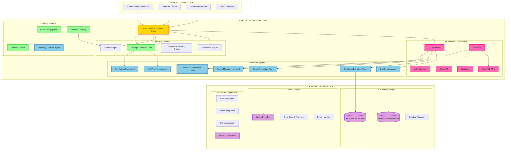

# TRM-OS AGE COMPREHENSIVE SYSTEM DESIGN V2.0
**Artificial Genesis Engine - Hệ Thống Sống Hoàn Chỉnh**

**Ngày tạo:** 2024-12-28  
**Phiên bản:** 2.0 - Complete Living System  
**Triết lý:** Recognition → Event → WIN với Commercial AI Orchestration  
**Deployment:** https://trmosngonlanh.up.railway.app/docs

---

## 🧭 I. EXECUTIVE SUMMARY - TRM-OS LIVING SYSTEM

### 🎯 Vision Statement
TRM-OS AGE là **"Hệ điều hành AI"** - một living organism có khả năng tự nhận thức, tự phục hồi, tự tiến hóa thông qua điều phối Commercial AI APIs (OpenAI, Claude, Gemini) thay vì train local ML models.

### 🏆 Core Value Proposition
- **Orchestrate Intelligence**: Điều phối thông minh các commercial AI services
- **Self-Healing**: Tự phục hồi khi gặp sự cố hoặc spam attacks  
- **Self-Evolving**: Tự tiến hóa capabilities dựa trên performance gaps
- **Strategic Learning**: Học từ WIN/FAIL để cải thiện chiến lược

---

## 🛠️ II. TECHNOLOGY STACK - COMMERCIAL AI ORCHESTRATION

### A. Core Technology Architecture

#### 1. **Web Framework Layer**
```yaml
Framework: FastAPI 0.110+
- High-performance async web framework
- Automatic OpenAPI documentation  
- Type safety với Pydantic
- WebSocket support cho real-time communication

ASGI Server: Uvicorn 0.29+
- Production-ready async server
- HTTP/2 support
- WebSocket protocol support
```

#### 2. **Database & Storage Layer**
```yaml
Primary Database: Neo4j 5.19+
- Graph database cho ontology relationships
- Cypher queries cho complex relationship analysis
- ACID transactions cho data consistency

Vector Database: Supabase Vector Store
- Commercial AI embeddings storage
- Semantic search capabilities
- Real-time subscriptions

Event Streaming: Redis/Kafka (Future)
- Event sourcing cho audit trail
- Real-time event distribution
- Microservice communication
```

#### 3. **Commercial AI Integration Layer**
```yaml
OpenAI Integration:
- GPT-4 cho advanced reasoning
- text-embedding-ada-002 cho vector embeddings
- DALL-E cho visual content generation

Claude Integration (Anthropic):
- Constitutional AI cho ethical reasoning
- Long context understanding
- Advanced conversation capabilities

Gemini Integration (Google):
- Multimodal AI capabilities
- Real-time processing
- Google ecosystem integration
```

#### 4. **Infrastructure & Deployment**
```yaml
Container Platform: Docker + Railway
- Container orchestration
- Auto-scaling capabilities
- CI/CD pipeline integration

Monitoring Stack:
- Health checks: FastAPI native
- Logging: Python logging + structured logs
- Metrics: Performance monitoring
- Alerting: Real-time issue detection
```

### B. Development Stack
```yaml
Language: Python 3.11+
- Type hints support
- Async/await native support
- Rich ecosystem

Package Management:
- requirements.txt cho dependencies
- Virtual environment isolation
- Development vs Production configs

Testing Framework:
- pytest 8.3+ với async support
- pytest-cov cho coverage tracking
- pytest-asyncio cho async testing
```

---

## 🏗️ III. KIẾN TRÚC TỔNG THỂ - LIVING SYSTEM ENHANCED



---

## 🔄 IV. STRATEGIC FEEDBACK LOOP - HỌC TỪ WIN/FAIL

### A. PostWinAnalysis Agent
```python
class PostWinAnalysisAgent(BaseAgent):
    """Phân tích kết quả WIN để cải thiện chiến lược"""
    
    def __init__(self):
        super().__init__(agent_id="post_win_analyzer")
        self.openai_client = OpenAIClient()
        self.claude_client = ClaudeClient()
    
    async def analyze_win_event(self, win_event: WinEvent) -> StrategicInsight:
        # 1. Multi-AI analysis
        openai_analysis = await self.openai_client.analyze_success_factors(win_event)
        claude_analysis = await self.claude_client.constitutional_analysis(win_event)
        
        # 2. Synthesize insights
        insights = await self._synthesize_ai_insights(openai_analysis, claude_analysis)
        
        # 3. Update AGE strategy
        await self._update_age_strategy(insights)
        
        return StrategicInsight(
            insight_type="WIN_ANALYSIS",
            ai_sources=["openai", "claude"],
            insights=insights,
            strategic_recommendations=insights.recommendations
        )
```

### B. PostFailAnalysis Agent
```python
class PostFailAnalysisAgent(BaseAgent):
    """Phân tích thất bại với Commercial AI coordination"""
    
    async def analyze_fail_event(self, fail_event: FailEvent) -> RecoveryPlan:
        # 1. Root cause analysis với Gemini
        gemini_analysis = await self.gemini_client.multimodal_analysis(fail_event)
        
        # 2. Recovery planning với GPT-4
        recovery_plan = await self.openai_client.generate_recovery_plan(
            fail_event, gemini_analysis
        )
        
        # 3. Update immune system
        await self._enhance_immune_system(recovery_plan.prevention_strategies)
        
        return recovery_plan
```

---

## 🛡️ V. SELF-HEALING & IMMUNE SYSTEM

### A. System Health Monitor với Commercial AI
```python
class SystemHealthMonitor:
    """AI-powered system health monitoring"""
    
    def __init__(self):
        self.health_ai = OpenAIClient(model="gpt-4")
        self.anomaly_detector = ClaudeClient()
    
    async def ai_powered_health_check(self):
        # 1. Collect system metrics
        metrics = await self._collect_system_metrics()
        
        # 2. AI anomaly detection
        anomalies = await self.anomaly_detector.detect_anomalies(metrics)
        
        # 3. Health assessment
        health_report = await self.health_ai.assess_system_health(
            metrics, anomalies
        )
        
        if health_report.critical_issues:
            await self._trigger_auto_healing(health_report)
```

### B. Recovery Guardian Agent
```python
class RecoveryGuardianAgent(BaseAgent):
    """AI-powered automatic recovery"""
    
    async def execute_ai_recovery(self, issue: SystemIssue) -> RecoveryResult:
        # 1. Generate recovery plan với multi-AI coordination
        recovery_plan = await self._coordinate_recovery_planning(issue)
        
        # 2. Execute với AI validation từng step
        for step in recovery_plan.steps:
            validation = await self.openai_client.validate_recovery_step(step)
            if validation.safe_to_execute:
                await self._execute_recovery_step(step)
            else:
                await self._escalate_to_human(issue, validation.concerns)
                break
```

---

## 🧬 VI. EVOLUTION PATHWAY - AI-DRIVEN SELF-EVOLUTION

### A. Capability Mutation Engine với Commercial AI
```python
class CapabilityMutationEngine:
    """AI-powered capability evolution"""
    
    async def evolve_capability_with_ai(self, gap: PerformanceGap) -> NewCapability:
        # 1. Multi-AI requirement analysis
        openai_req = await self.openai_client.analyze_capability_requirements(gap)
        claude_req = await self.claude_client.constitutional_requirements(gap)
        
        # 2. AI-generated capability design
        capability_design = await self.gemini_client.design_new_capability(
            openai_req, claude_req
        )
        
        # 3. AI code generation
        implementation = await self.openai_client.generate_capability_code(
            capability_design
        )
        
        # 4. AI-powered testing
        test_results = await self._ai_test_capability(implementation)
        
        return NewCapability(
            design=capability_design,
            implementation=implementation,
            test_results=test_results
        ) if test_results.success else None
```

---

## ⏰ VII. TEMPORAL REASONING ENGINE INTEGRATION

### A. AI-Enhanced Temporal Analysis
```python
class TemporalReasoningEngine:
    """Commercial AI-powered temporal reasoning"""
    
    async def predict_future_scenarios(self, current_state: SystemState) -> List[FutureScenario]:
        # 1. Historical pattern analysis với OpenAI
        patterns = await self.openai_client.analyze_historical_patterns(current_state)
        
        # 2. Future scenario generation với Claude
        scenarios = await self.claude_client.generate_future_scenarios(
            current_state, patterns
        )
        
        # 3. Probability assessment với Gemini
        for scenario in scenarios:
            scenario.probability = await self.gemini_client.assess_probability(scenario)
        
        return sorted(scenarios, key=lambda s: s.probability, reverse=True)
```

---

## 📊 VIII. API ENDPOINTS ARCHITECTURE

### A. Current API Status (Deployed)
```
Production URL: https://trmosngonlanh.up.railway.app/

✅ WORKING ENDPOINTS:
- GET / -> Welcome message
- GET /health -> System health
- GET /api/v1/projects/ -> Project management
- GET /api/v1/agents/ -> Agent management  
- GET /api/v1/events/ -> Event tracking
- GET /api/v1/wins/ -> WIN tracking
- GET /api/v1/recognitions/ -> Recognition system

⚠️ NEEDS FIXING:
- GET /api/v1/tensions/ -> 422 validation error
- GET /api/v1/tasks/ -> 422 validation error

❌ MISSING (Critical for AGE):
- /api/v1/commercial-ai/* -> Commercial AI endpoints
- /api/v1/reasoning/* -> Reasoning engine
- /api/v1/age/* -> AGE orchestration
- /api/v1/strategic-feedback/* -> Strategic learning
- /api/v1/self-healing/* -> Self-healing system
- /api/v2/* -> Advanced features
```

### B. Required AGE API Endpoints
```python
# Commercial AI Coordination
POST /api/v1/commercial-ai/coordinate -> Multi-AI task coordination
POST /api/v1/commercial-ai/synthesize -> AI response synthesis
GET  /api/v1/commercial-ai/health -> AI services health

# AGE Orchestration
POST /api/v1/age/orchestrate -> Central AGE coordination
GET  /api/v1/age/status -> AGE system status
POST /api/v1/age/evolve -> Trigger evolution cycle

# Strategic Feedback Loop  
POST /api/v1/strategic-feedback/win-analysis -> Post-WIN analysis
POST /api/v1/strategic-feedback/fail-analysis -> Post-FAIL analysis
GET  /api/v1/strategic-feedback/insights -> Strategic insights

# Self-Healing System
GET  /api/v1/self-healing/health -> Comprehensive health check
POST /api/v1/self-healing/recover -> Trigger recovery process
GET  /api/v1/self-healing/immune-status -> Immune system status

# Evolution Pathway
POST /api/v1/evolution/mutate-capability -> Create new capabilities
POST /api/v1/evolution/genesis-agent -> Generate new agents
GET  /api/v1/evolution/mutations -> Track evolution history

# Temporal Reasoning
POST /api/v1/temporal/predict-scenarios -> Future scenario prediction
POST /api/v1/temporal/optimize-timeline -> Timeline optimization
GET  /api/v1/temporal/insights -> Temporal insights
```

---

## 🔧 IX. IMPLEMENTATION ROADMAP - PRODUCTION READY

### Phase 2.1: Commercial AI Integration (2 tuần)
```yaml
Week 1-2: Core Commercial AI Services
- OpenAI GPT-4 integration
- Claude API integration  
- Gemini API integration
- AI Router và Synthesizer
- Basic coordination endpoints

Dependencies:
- openai==1.0+
- anthropic==0.8+
- google-generativeai==0.3+
```

### Phase 2.2: Strategic Feedback Loop (2 tuần)  
```yaml
Week 3-4: Learning from WIN/FAIL
- PostWinAnalysis Agent implementation
- PostFailAnalysis Agent implementation
- Strategic insight extraction
- AGE strategy updating mechanism

Dependencies:
- Existing Event system
- Commercial AI services from 2.1
```

### Phase 2.3: Self-Healing System (2 tuần)
```yaml
Week 5-6: Autonomous Recovery
- SystemHealthMonitor với AI
- RecoveryGuardian Agent
- Immune system rules và patterns
- Auto-healing workflows

Dependencies:
- System monitoring infrastructure
- Commercial AI services
```

### Phase 2.4: Evolution Pathway (3 tuần)
```yaml
Week 7-9: Self-Evolution Capabilities
- CapabilityMutationEngine
- AgentGenesisProcess
- AI-powered code generation
- Evolution testing framework

Dependencies:
- All previous phases
- Advanced AI code generation
```

### Phase 2.5: Temporal Reasoning (2 tuần)
```yaml
Week 10-11: Future Prediction
- TemporalReasoningEngine với AI
- Future scenario generation
- Timeline optimization
- Predictive insights

Dependencies:
- Historical data analysis
- Commercial AI services
```

### Phase 2.6: System Integration (1 tuần)
```yaml
Week 12: Full Integration
- End-to-end testing
- Performance optimization
- Documentation updates
- Production deployment
```

---

## 📊 X. SUCCESS METRICS - LIVING SYSTEM KPIs

### A. Commercial AI Coordination Metrics
- **Multi-AI Response Time**: < 3 seconds
- **AI Service Uptime**: > 99.5%  
- **Response Quality Score**: > 4.5/5
- **Cost Efficiency**: < $0.10 per request

### B. Self-Healing Metrics
- **MTTR (Mean Time To Recovery)**: < 5 minutes
- **Auto-Recovery Success Rate**: > 85%
- **Anomaly Detection Accuracy**: > 90%
- **False Positive Rate**: < 5%

### C. Evolution Metrics
- **Successful Capability Mutations**: 1-2 per month
- **Agent Genesis Success Rate**: > 70%
- **Performance Improvement**: +15% quarterly
- **Evolution Cycle Time**: < 24 hours

### D. Strategic Learning Metrics
- **WIN Pattern Recognition**: > 80% accuracy
- **Strategy Adaptation Speed**: < 12 hours
- **Decision Quality Improvement**: +25% over 6 months
- **Learning Retention**: > 90%

---

## 🎯 XI. TECHNOLOGY REQUIREMENTS UPDATE

### A. Updated requirements.txt
```python
# Core Framework (Current)
fastapi==0.110.0
uvicorn==0.29.0
pydantic==2.11.7

# Database (Current)  
neo4j==5.19.0
neomodel==5.3.0

# NEW: Commercial AI Integration
openai==1.50.0
anthropic==0.8.0
google-generativeai==0.3.0

# NEW: Vector Database
supabase==2.0.0
weaviate-client==3.24.0

# NEW: Event Streaming
redis==5.0.0
kafka-python==2.0.2

# NEW: Monitoring & Health
prometheus-client==0.19.0
psutil==5.9.0

# Testing (Enhanced)
pytest==8.3.5
pytest-asyncio==1.0.0
pytest-cov==5.0.0
httpx==0.27.0

# Development Tools
black==23.0.0
flake8==6.0.0
mypy==1.5.0
```

### B. Environment Configuration
```yaml
# .env template
# Commercial AI APIs
OPENAI_API_KEY=sk-xxx
ANTHROPIC_API_KEY=sk-ant-xxx  
GOOGLE_API_KEY=AIzaSy-xxx

# Database
NEO4J_URI=neo4j+s://xxx.databases.neo4j.io
NEO4J_USERNAME=neo4j
NEO4J_PASSWORD=xxx

# Supabase Vector Store
SUPABASE_URL=https://xxx.supabase.co
SUPABASE_ANON_KEY=xxx

# System Configuration
AGE_ORCHESTRATION_ENABLED=true
SELF_HEALING_ENABLED=true
EVOLUTION_PATHWAY_ENABLED=true
COMMERCIAL_AI_COORDINATION_ENABLED=true
```

---

## 🔄 XII. CURRENT STATUS & NEXT ACTIONS

### A. Current Deployment Status
- **Production URL**: https://trmosngonlanh.up.railway.app/docs
- **API Version**: v1.0 (Partial implementation)
- **Core Entities**: Projects, Agents, Events, WINs, Recognitions ✅
- **Missing Components**: Commercial AI, AGE Core, Self-Healing, Evolution

### B. Immediate Actions Required
1. **Fix validation errors**: Tensions, Tasks endpoints (422 errors)
2. **Implement Commercial AI layer**: OpenAI, Claude, Gemini integration
3. **Create AGE orchestration endpoints**: Central coordination system  
4. **Add self-healing capabilities**: Health monitoring, auto-recovery
5. **Build evolution pathway**: Capability mutation, agent genesis

### C. Success Criteria
- ✅ All API endpoints return 200 status
- ✅ Commercial AI coordination operational
- ✅ Self-healing system functional  
- ✅ Evolution pathway creating new capabilities
- ✅ Strategic feedback loop learning from WIN/FAIL
- ✅ Sub-3 second multi-AI response times
- ✅ 99.5% system uptime với auto-recovery

---

## 🎯 XIII. CONCLUSION: FROM TOOL TO LIVING ORGANISM

Với design này, TRM-OS AGE sẽ trở thành:

✅ **Một sinh vật sống thông minh** - tự phục hồi, tự tiến hóa, tự học hỏi  
✅ **Một đối tác AI** - không chỉ thực thi mà còn tư vấn chiến lược  
✅ **Một hệ điều hành AI** - điều phối commercial AI services hiệu quả  
✅ **Một tổ chức tự trị** - hoạt động độc lập nhưng vẫn phục vụ con người  

**Điều quan trọng nhất:** AGE KHÔNG thay thế con người, mà tạo ra **sự cộng hưởng hoàn hảo** giữa Commercial AI services và trí tuệ con người, đúng như triết lý TRM-OS.

**Next Action**: Implement Phase 2.1 - Commercial AI Integration để bắt đầu biến TRM-OS thành living system.

---

**Document Status**: Master Blueprint - Production Ready Architecture  
**Last Updated**: 2024-12-28  
**Next Review**: 2025-01-15 