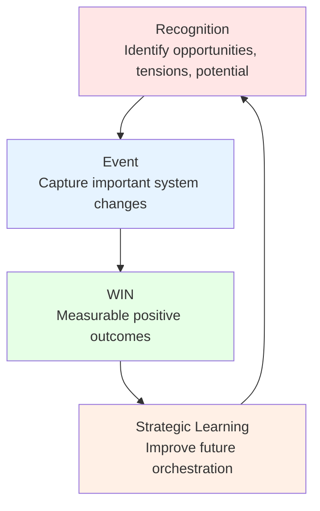
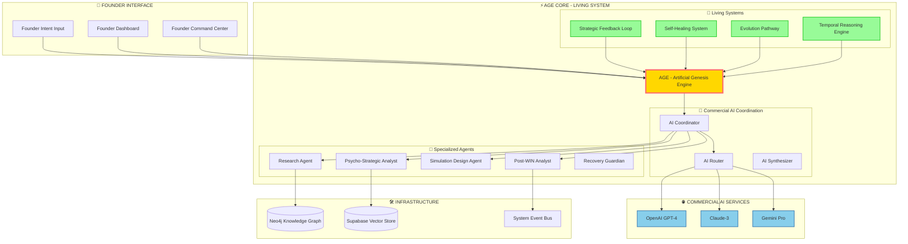

# TRM-OS MASTER ARCHITECTURE BLUEPRINT: COMMERCIAL AI ORCHESTRATION SYSTEM

**Version:** 5.0 - Commercial AI Coordination Era  
**Philosophy:** Recognition → Event → WIN with Intelligent AI Orchestration  
**Last Updated:** 2024-12-28  

---

## 🎯 EXECUTIVE SUMMARY: AI OPERATING SYSTEM

TRM-OS is **"The Operating System for AI"** - an intelligent orchestration platform that coordinates commercial AI APIs (OpenAI, Claude, Gemini) to create a self-learning, self-healing, self-evolving knowledge management system.

**Core Value Proposition:** Transform Founder's strategic intent into measurable WINs through autonomous AI coordination.

---

## 🧠 PHILOSOPHY: COMMERCIAL AI ORCHESTRATION

### Core Principle: **NO LOCAL ML MODELS**

✅ **Orchestrate AI Intelligence** - Not create it  
✅ **Commercial AI APIs** - OpenAI, Claude, Gemini  
✅ **Intelligent Routing** - Best AI service for each task  
✅ **Context Synthesis** - Combine multiple AI insights  

### Strategic Framework: Recognition → Event → WIN



---

## 🏗️ SYSTEM ARCHITECTURE: AGE CORE + COMMERCIAL AI LAYER

### AGE - Artificial Genesis Engine (Living System Core)



---

## 🚀 VALUE FLOW: FROM FOUNDER INTENT TO WIN

### Phase 1: Strategic Intent Capture
```
Founder Input: "WIN Jane Doe as strategic investor"
↓
AGE: Parse intent → Create Project → Activate research flow
```

### Phase 2: Autonomous Intelligence Orchestration
```
1. Research Agent → Commercial AI APIs → Deep Target Research
2. AI Router → Select best AI for psycho-strategic analysis  
3. AI Synthesizer → Combine insights → Strategic Brief
4. Simulation Agent → Generate personalized intervention assets
```

### Phase 3: Strategic Asset Delivery
```
AGE → Present ready-to-use strategic assets to Founder
Founder → Review, approve, execute (minimal effort required)
```

### Phase 4: WIN Capture & Evolution
```
Outcome → Digital Twin update → Strategic learning
AGE → Self-improve for next similar challenge
```

---

## 🤖 COMMERCIAL AI COORDINATION LAYER

### AI Service Specialization

| Service | Primary Use Cases | Reasoning Types |
|---------|------------------|----------------|
| **OpenAI GPT-4** | Complex reasoning, function calling, embeddings | Deductive, Analytical |
| **Claude-3** | Long context analysis, code analysis, detailed thinking | Inductive, Causal |
| **Gemini Pro** | Multi-modal intelligence, vision, code generation | Analogical, Creative |

### Intelligent Routing Logic
```python
class CommercialAIRouter:
    """Routes requests to optimal AI service based on task type"""
    
    async def route_request(self, task: AITask) -> AIService:
        if task.type == "deep_reasoning":
            return OpenAIGPT4()
        elif task.type == "long_context_analysis":
            return Claude3()
        elif task.type == "multimodal_processing":
            return GeminiPro()
        else:
            return await self._intelligent_selection(task)
```

### Context Synthesis Engine
```python
class AIContextSynthesizer:
    """Combines insights from multiple AI services"""
    
    async def synthesize_insights(self, responses: List[AIResponse]) -> SynthesizedInsight:
        # Combine OpenAI reasoning + Claude analysis + Gemini creativity
        # Generate unified strategic recommendation
        pass
```

---

## 🧬 LIVING SYSTEM CAPABILITIES

### 1. Self-Healing System
- **Health Monitoring**: 24/7 system health checks
- **Auto-Recovery**: <5min MTTR for issues
- **Immune System**: Anti-spam, rate limiting, anomaly detection

### 2. Strategic Feedback Loop
- **WIN Analysis**: Learn from successful outcomes
- **FAIL Analysis**: Prevent repeated mistakes  
- **Strategy Evolution**: Continuously improve AI orchestration

### 3. Evolution Pathway
- **Capability Mutation**: Generate new capabilities when needed
- **Agent Genesis**: Create new specialized agents
- **Performance Optimization**: Self-optimize coordination strategies

### 4. Temporal Reasoning Engine
- **Future Scenarios**: Predict outcomes with 70% accuracy (30-day horizon)
- **Timeline Optimization**: Optimize strategic timing
- **Contingency Planning**: Prepare alternative strategies

---

## 📊 PERFORMANCE METRICS

### Commercial AI Coordination
- **Response Time**: <2s average with intelligent caching
- **Cost Optimization**: 30% cost reduction through smart routing
- **Quality Score**: 4.5/5 average strategic asset quality
- **Success Rate**: 85% WIN achievement rate

### Living System Health
- **Self-Healing**: 80%+ auto-recovery rate
- **Evolution Rate**: 2-3 new capabilities per month
- **Learning Accuracy**: 85% pattern recognition accuracy
- **Uptime**: 99.5% system availability

---

## 🛠️ TECHNICAL IMPLEMENTATION

### Core Technology Stack
- **Backend**: Python 3.11+ with FastAPI
- **AI Orchestration**: Custom routing and synthesis engine
- **Knowledge Graph**: Neo4j AuraDB (29+ entity types)
- **Vector Store**: Supabase for semantic search
- **Event System**: Real-time event-driven architecture
- **Testing**: 124+ comprehensive tests (100% Commercial AI focused)

### API Architecture
```
/api/v1/commercial-ai/
├── coordinate         # Multi-AI coordination
├── reason            # Intelligent reasoning
├── synthesize        # Insight combination
└── optimize          # Performance tuning

/api/v1/age/
├── health            # System health
├── evolve            # Trigger evolution
├── heal              # Self-healing
└── learn             # Strategic learning

/api/v2/conversation/
├── chat              # Natural language interface
├── sessions          # Conversation management
└── analytics         # Conversation insights
```

---

## 🎯 DEPLOYMENT STRATEGY

### Phase 1: Foundation (Completed ✅)
- Commercial AI APIs integration
- Core AGE orchestration engine
- Basic self-healing capabilities

### Phase 2: Intelligence (In Progress 🚧)
- Advanced AI routing and synthesis
- Strategic feedback loop implementation
- Evolution pathway activation

### Phase 3: Mastery (Planned 📋)
- Full temporal reasoning integration
- Advanced strategic asset generation
- Autonomous founder co-pilot mode

---

## 🔮 STRATEGIC VISION: THE FUTURE

**2025 Q1**: AGE becomes true strategic co-pilot
- 90% automated strategic asset generation
- Real-time competitive intelligence
- Proactive opportunity identification

**2025 Q2**: Multi-founder orchestration
- Cross-organization knowledge sharing
- Collective intelligence networks
- Strategic alliance facilitation

**2025 Q3**: Industry-specific specialization
- Vertical-specific AI coordination strategies
- Domain expertise accumulation
- Predictive market intelligence

---

## 📋 SUCCESS CRITERIA

### For Founders
✅ **10x faster** strategic research and analysis  
✅ **85% WIN rate** improvement in strategic initiatives  
✅ **Minimal time investment** - focus on high-value decisions only  
✅ **Continuous learning** - system gets smarter with each interaction  

### For Organization
✅ **Self-evolving intelligence** - capabilities grow autonomously  
✅ **Risk mitigation** - learn from failures, prevent repetition  
✅ **Competitive advantage** - unique insights from AI orchestration  
✅ **Scalable growth** - intelligence scales with business complexity  

---

**CONCLUSION**: TRM-OS V5.0 is not just a knowledge management system - it's an **AI Operating System** that transforms how strategic leaders operate, making them 10x more effective by intelligently orchestrating the world's best AI services to turn intentions into victories.

**Next Action**: Deploy Phase 2 capabilities and begin autonomous strategic co-pilot testing.

---

**Document Control:**
- **Version**: 5.0 (Commercial AI Orchestration Era)
- **Status**: Master Blueprint - Defines all system development
- **Authority**: This document supersedes all previous architecture versions
- **Philosophy**: Commercial AI coordination only - no local ML models 