# Học Thuyết Thống Nhất TRM-OS - Tập 4: Tổng quan Kiến trúc Kỹ thuật

**Phiên bản:** 1.0
**Trạng thái:** Hoàn thiện
**Người biên soạn:** Gemini-Pro Agent & Human Co-founder

---

## **Lời nói đầu: Biến Triết lý thành Dòng Code**

Nếu các tập trước định nghĩa "linh hồn" và "luật chơi" của hệ thống, thì tập này phác thảo "cơ thể vật lý" của nó. Đây là bản thiết kế cấp cao, biến các khái niệm trong Học Thuyết thành một kiến trúc kỹ thuật có thể xây dựng được, đảm bảo rằng triết lý được khắc vào từng dòng code, từng service.

---

## **Chương 5: Triết lý và Sơ đồ Kiến trúc**

### **5.1. Triết lý Kiến trúc**

Kiến trúc của TRM-OS được xây dựng trên ba trụ cột chính:

1.  **Event-Driven (Hướng sự kiện):** Hệ thống không ở trạng thái chờ lệnh. Nó phản ứng một cách tự chủ với các `Events` (sự thật) xảy ra trong và ngoài tổ chức. Điều này đảm bảo tính tức thời và khả năng thích ứng liên tục.
2.  **Agent-Based (Dựa trên Tác nhân):** Mọi hành động trong hệ thống đều được thực thi bởi các `Agent` (AI hoặc Người). Kiến trúc này mô phỏng một tổ chức sống, nơi các tác nhân tự chủ chịu trách nhiệm về các nhiệm vụ cụ thể, thay vì một hệ thống nguyên khối, tập trung.
3.  **Ontology-Centric (Lấy Ontology làm trung tâm):** Toàn bộ hệ thống được xây dựng xung quanh một `Knowledge Graph` (Đồ thị Tri thức) duy nhất, chứa đựng toàn bộ `Ontology` (các thực thể và mối quan hệ giữa chúng). Điều này đảm bảo mọi thành phần đều "nói cùng một ngôn ngữ" và hành động dựa trên một "bản đồ thực tại" thống nhất.

### **5.2. Sơ đồ Khối Cấp cao (High-Level Block Diagram)**

```mermaid
graph TD
    subgraph ExternalWorld [Thế giới Bên ngoài]
        ExtAPI[API Tin tức, Mạng xã hội, Dữ liệu Tài chính]
        HumanInput[Founder/User Input]
    end

    subgraph TRM_OS [TRM Operating System]
        subgraph SenseLayer [Sense Layer]
            EventCollector[Event Collector]
        end

        subgraph CoreLogic [Core Logic & Reasoning]
            ResonanceEngine[Resonance Engine]
            ProjectOrchestrator[Project Orchestrator]
            AgentCore[Agent Core]
        end

        subgraph KnowledgeBase [Knowledge & State]
            KnowledgeGraph[Ontology & Knowledge Graph]
            ResourceLedger[Resource Ledger]
        end

        ExtAPI --> EventCollector
        HumanInput --> AgentCore

        EventCollector -- New Events --> ResonanceEngine
        ResonanceEngine -- Potential Tensions --> AgentCore
        AgentCore -- Approved Projects --> ProjectOrchestrator
        AgentCore -- Executes Tasks --> ExternalWorld
        
        ProjectOrchestrator -- Task Status --> KnowledgeGraph
        ProjectOrchestrator -- Requests Agents --> AgentCore

        ResonanceEngine -- Reads --> KnowledgeGraph
        AgentCore -- Reads/Writes --> KnowledgeGraph
        ProjectOrchestrator -- Reads/Writes --> KnowledgeGraph

        KnowledgeGraph -- Updates --> ResourceLedger
        
    end

    style TRM_OS fill:#f9f9f9,stroke:#333,stroke-width:2px
```

---

## **Chương 6: Mô tả các Thành phần Chính (Core Components)**

### **6.1. Sense Layer (Lớp Quan sát)**
*   **Chức năng:** Là "giác quan" của TRM-OS, có nhiệm vụ duy nhất là thu thập các sự kiện từ thế giới bên ngoài và bên trong, sau đó chuẩn hóa chúng thành các đối tượng `Event` bất biến.
*   **Thành phần con:**
    *   **`Event Collector`:** Bao gồm một tập hợp các adapter và crawler để kết nối với các API bên ngoài (ví dụ: Bloomberg, Twitter, SEC filings) và các hệ thống nội bộ (ví dụ: Git logs, CRM). Nó lắng nghe và biến đổi dữ liệu thô thành các `Event` có cấu trúc.
*   **Luồng hoạt động:** `Event Collector` liên tục quét các nguồn dữ liệu. Khi phát hiện một sự kiện (ví dụ: một công ty trong danh sách theo dõi nộp báo cáo quý), nó sẽ tạo một đối tượng `Event` và đẩy vào `Resonance Engine`.

### **6.2. Resonance Engine (Cỗ máy Cộng hưởng)**
*   **Chức năng:** Đây là "bộ não" phân tích của hệ thống. Nó nhận các `Event` mới và đối chiếu chúng với các `Internal Capability` được lưu trữ trong `Knowledge Graph`.
*   **Luồng hoạt động:**
    1.  Nhận một `Event` mới từ `Sense Layer`.
    2.  Truy vấn `Knowledge Graph` để lấy danh sách các năng lực nội tại (ví dụ: "có khả năng mô phỏng tài chính", "có mạng lưới quan hệ trong ngành X").
    3.  Sử dụng các mô hình AI để đánh giá mức độ "cộng hưởng" giữa `Event` và từng `Capability`.
    4.  Nếu mức độ cộng hưởng vượt qua một ngưỡng nhất định, nó sẽ tạo ra một đối tượng `Tension` (một giả thuyết chiến lược) và gửi đến `Agent Core` để `Human Agent` xem xét.

### **6.3. Project Orchestrator (Bộ điều phối Dự án)**
*   **Chức năng:** Là "hệ thần kinh vận động" của TRM-OS. Khi một `Project` được `Human Agent` phê duyệt, `Project Orchestrator` sẽ chịu trách nhiệm quản lý vòng đời của nó.
*   **Luồng hoạt động:**
    1.  Nhận một `Project` đã được phê duyệt từ `Agent Core`.
    2.  Sử dụng AI để phân rã mục tiêu của `Project` thành một chuỗi các `Task` cụ thể.
    3.  Gửi yêu cầu đến `Agent Core` để điều phối các `Agent` phù hợp nhất cho từng `Task`.
    4.  Theo dõi trạng thái hoàn thành của các `Task`, cập nhật `Knowledge Graph` và báo cáo tiến độ.

### **6.4. Agent Core (Nhân Tác nhân)**
*   **Chức năng:** Là trung tâm chỉ huy và kiểm soát cho tất cả các `Agent`. Nó hoạt động như một giao diện giữa `Human Agent` và hệ thống, đồng thời là một "người quản lý" cho các `AI Agent`.
*   **Luồng hoạt động:**
    *   **Tương tác Người-Máy:** Trình bày các `Tension` và các đề xuất `Project` cho `Human Agent` (Founder) thông qua một giao diện người dùng trực quan để họ ra quyết định.
    *   **Điều phối AI:** Nhận yêu cầu về `Task` từ `Project Orchestrator`, lựa chọn `AI Agent` phù hợp nhất từ một "bể" các agent chuyên biệt (ví dụ: `DataAnalysis-AGE`, `Code-Generation-AGE`) và giao nhiệm vụ.

### **6.5. Resource Ledger (Sổ cái Nguồn lực)**
*   **Chức năng:** Là hệ thống kế toán duy nhất cho tất cả các loại `Resource`, cả cứng và mềm. Nó cung cấp một cái nhìn thời gian thực về "sức khỏe" của tổ chức.
*   **Thành phần con:**
    *   **Hard Resource Tracker:** Theo dõi các tài sản có thể định lượng như tiền mặt, thời gian làm việc của nhân viên, tài nguyên máy tính.
    *   **Soft Resource Valuator:** Sử dụng các mô hình phức tạp hơn để ước tính và theo dõi giá trị của các tài sản mềm như uy tín thương hiệu (ví dụ: dựa trên số lần được nhắc đến trên truyền thông), sức mạnh mạng lưới (dựa trên các kết nối trong `Knowledge Graph`).
*   **Luồng hoạt động:** Khi một `WIN` xảy ra và được ghi nhận trong `Knowledge Graph`, `Resource Ledger` sẽ tự động cập nhật số dư `Resource` tương ứng. Tương tự, khi một `Project` tiêu thụ `Resource`, sổ cái cũng sẽ được cập nhật.

### **6.6. Ontology & Knowledge Graph (Ontology & Đồ thị Tri thức)**
*   **Chức năng:** Đây là "trái tim" và "bộ nhớ" của toàn bộ hệ thống. Nó không chỉ là một cơ sở dữ liệu, mà là một mô hình sống động của toàn bộ tổ chức và môi trường của nó.
*   **Cấu trúc:** Một cơ sở dữ liệu đồ thị (Graph Database) nơi mọi `Entity` (Event, Tension, Project, Agent, v.v.) là một node, và mọi mối quan hệ ("được tạo ra từ", "giải quyết", "thực thi bởi") là một cạnh (edge).
*   **Luồng hoạt động:** Mọi thành phần khác trong hệ thống đều đọc và ghi vào `Knowledge Graph`. Nó cung cấp bối cảnh cho `Resonance Engine`, lưu trữ trạng thái cho `Project Orchestrator`, và ghi lại lịch sử cho các phân tích trong tương lai. Nó là hiện thân sống của toàn bộ Học Thuyết Thống Nhất. 